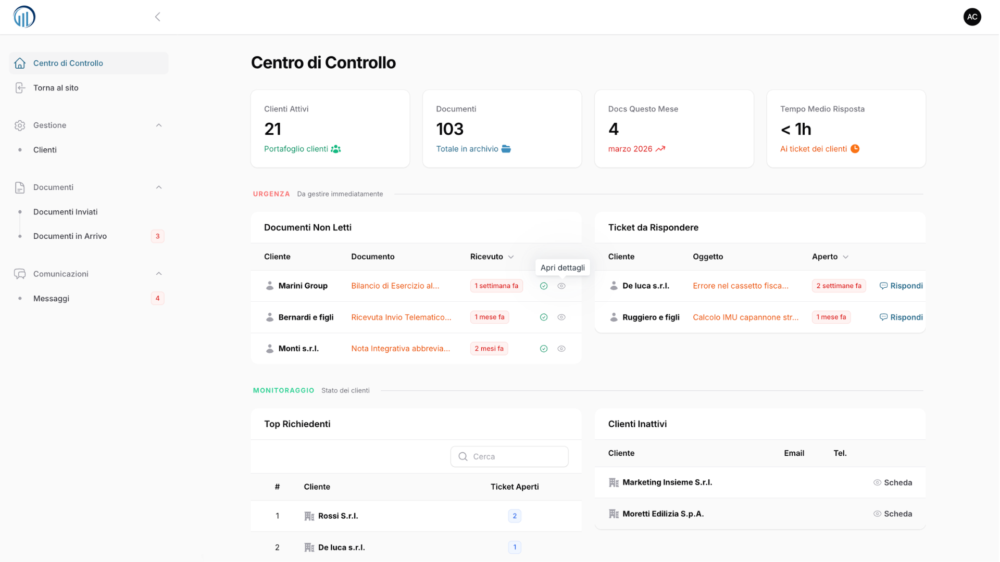
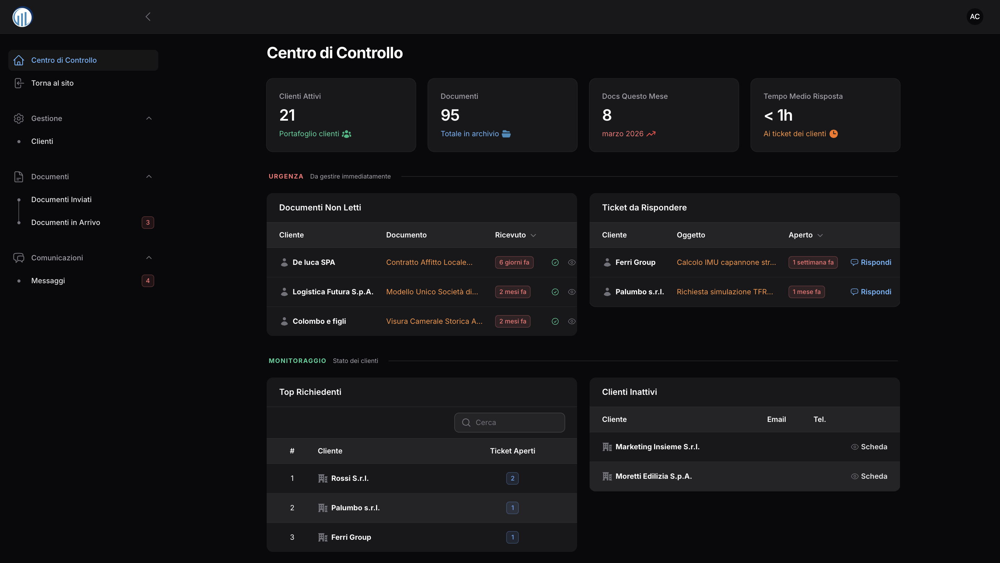
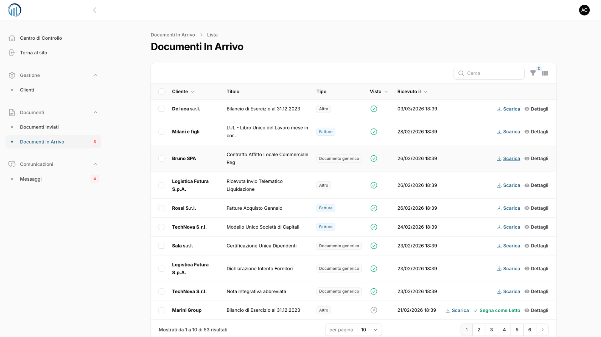
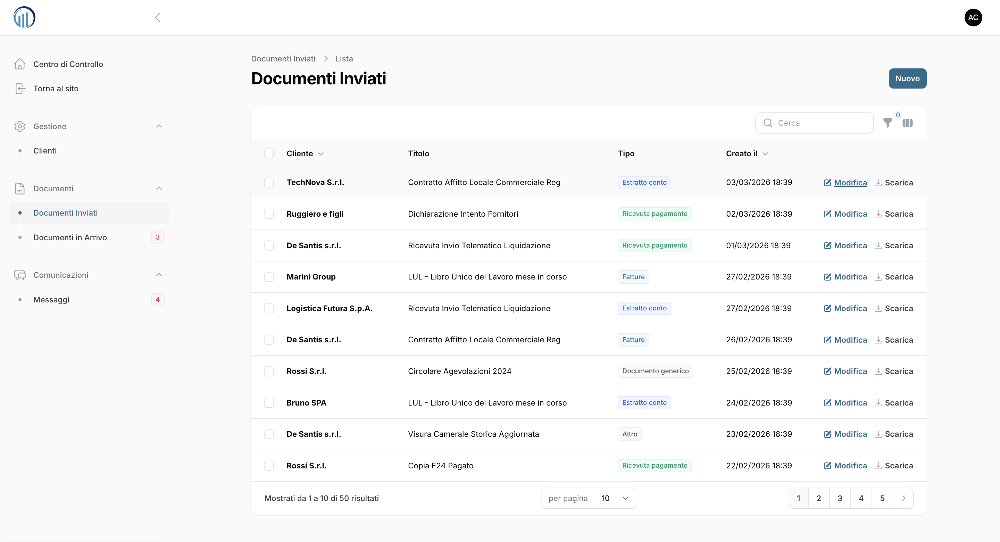
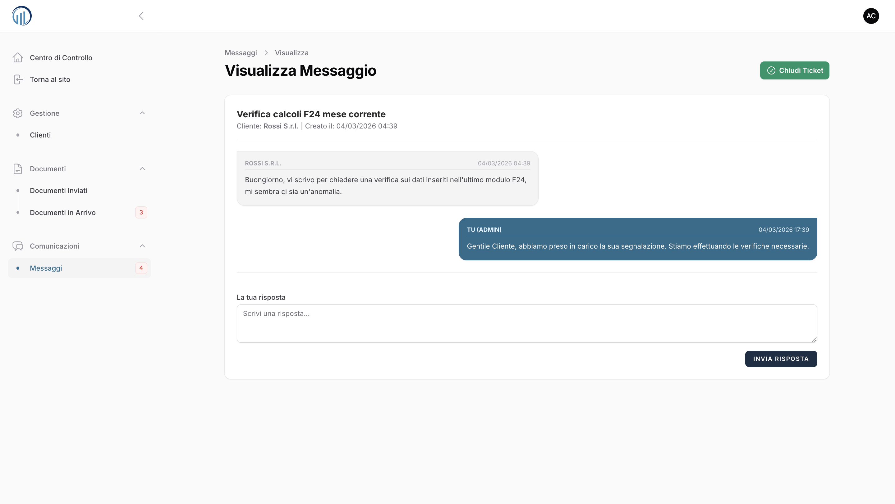
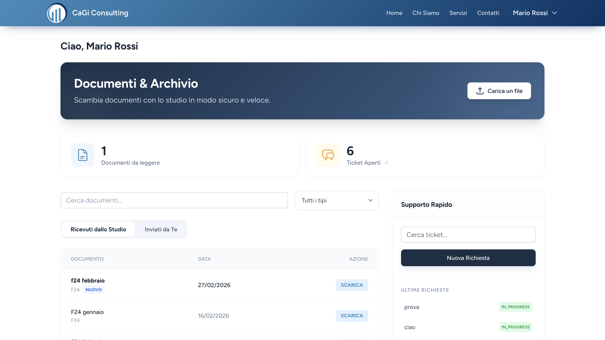
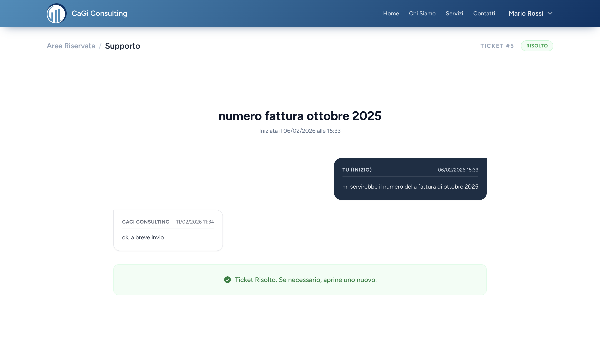
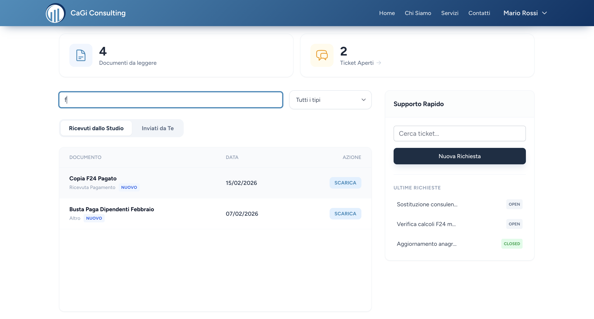
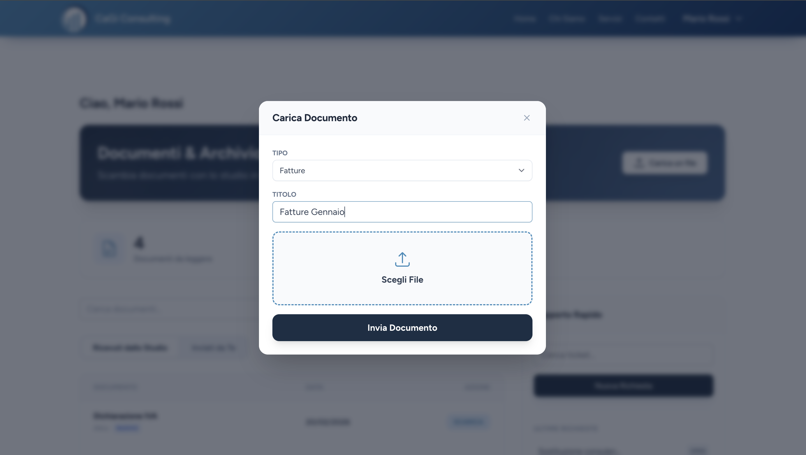
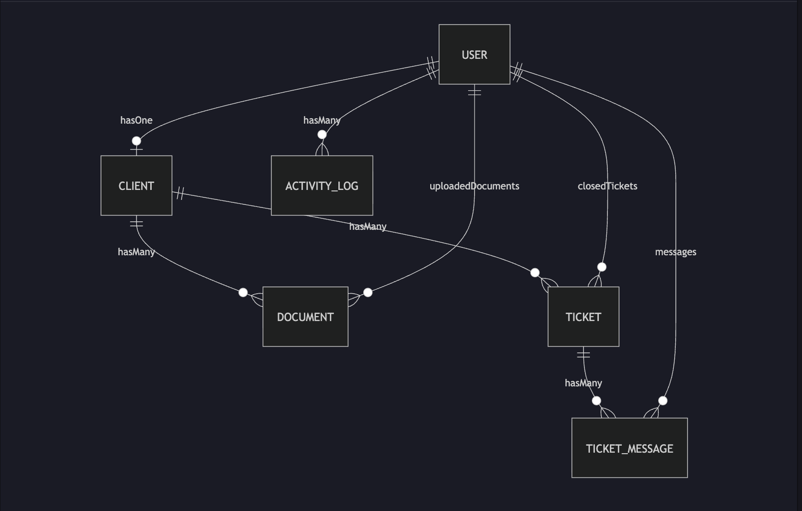

# Platform Screenshots

This section provides an overview of the main interfaces and workflows of the CaGi Consulting platform.

The screenshots highlight both the **administrative backoffice** used by the consulting firm and the **client-facing portal** used by customers to interact with the platform.

---

# Admin Interface

The administrative panel allows the consulting firm to manage documents, client communications and support requests through a centralized dashboard.

## Dashboard – Light Mode

Overview of the administrative dashboard showing key information and quick access to platform features.

---

## Dashboard – Dark Mode

Alternative dark theme of the administrative dashboard for improved usability during extended work sessions.

---

## Incoming Documents

Interface used by the firm to review and manage documents uploaded by clients.

---

## Sent Documents

Interface for sending documents from the firm to clients with structured storage and tracking.

---

## Ticket Management

Support ticket interface used by the firm to communicate with clients through a structured conversation system.

---

# Client Portal

The client portal allows customers to securely access documents and communicate with the consulting firm.

## Client Dashboard

Main client dashboard providing quick access to documents and support tickets.

---

## Ticket Conversation

Clients can communicate with the firm through a structured ticket system with threaded messages.

---

## Document Search

Live document search interface powered by dynamic filtering.

---

## Document Upload

Secure document upload interface allowing clients to send files directly to the consulting firm.

---

# Database Schema

Overview of the platform database structure showing the main entities and relationships.

The schema highlights the core architecture supporting:

- user roles
- document management
- ticketing system
- client–firm communication workflows

